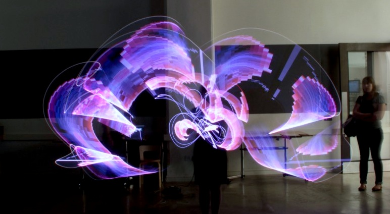

# TWSU Light Paint

_This project was originally developed for [Technology Will Save
Us](https://www.techwillsaveus.com/blog/light-painting-at-the-va-web-weekend/)
and was hosted on Bitbucket (before BB removed all Mercurial repos). Only links
and formatting in this Readme have been updated from the original version..._

## About

For the special Web weekend held at the [V&A Museum
London](http://www.vam.ac.uk) on 15-17 July 2011, we decided to prepare a little
showcase of our custom developed, modular & DMX-capable LED light strip. We
create a small app to allow users searching Flickr & Twitter, selecting a result
image (or message) and then send it as slit-scanned bitmap to the LED strip,
using the [Art-Net protocol](http://en.wikipedia.org/wiki/Art-Net) (basically
[DMX512](http://en.wikipedia.org/wiki/DMX512) over IP). We then took lots of
long exposure shots of people drawing with the light strip and the mapped
images. Some amazing results were created. Check them out [here on
Flickr](http://www.flickr.com/photos/danielhirschmann/sets/72157627086323073/)...



## The software

Even though the LED strip is not yet available for purchase, we have made the
software already available for your tinkering/learning joy. The app is written
in Java (and some Processing) and was developed with Eclipse. It also uses a
number of other libraries and therefore might be quite interesting as learning
material/project:

- [artnet4j](https://github.com/postspectacular/artnet4j)
- [controlP5](http://www.sojamo.de/libraries/controlP5/)
- [cp5magic](https://github.com/postspectacular/cp5magic)
- [flickrj](http://flickrj.sourceforge.net/)
- [sDrop](http://www.sojamo.de/libraries/drop/)
- [toxiclibs](https://github.com/postspectacular/toxiclibs)

Other software concepts & techniques used:

- XML parsing with JAXB
- Application states
- Multi-threading & concurrent data queues
- Asynchronous event callbacks
- Atom feed parsing with toxiclibs

Some brief getting started steps are listed below...

### Checking out source code

```bash
git clone https://github.com/postspectacular/twsu-lightpaint
```

### Importing into Eclipse

In Eclipse, choose `File > Import... > Existing projects into workspace`

Then browse to the `twsu-lightpaint` folder you just checked out (or unzipped
from the archive). Click `Ok` and you should see the project listed. Tick the
checkbox to select it and then press `Finish` to complete the import.

You should now see the project listed in the Eclipse Package Explorer.

### Configuring the app

#### Flickr API

Before running the app for the first time, you'll need to configure it with a
valid Flickr API key. This is required in order to search Flickr for tagged
images. If you haven't got a key yet, create one over here:
http://flickr.com/services/apps/create/

Now paste the API key into the XML config file located here:
/config/appconfig.xml

```xml
<flickr>
    <apikey>YOUR_FLICKR_API_KEY</apikey>
    <maxImages>50</maxImages>
</flickr>
```

The config file contains a lot more options to tweak the overall behaviour and
look & feel, incl. Art-Net settings

#### Art-Net devices

**This step is optional:** If you have an Art-Net compatible device connected,
insert its IP address into the field below and adjust the number of DMX channels
& universe ID

```xml
<artnet pollinterval="6000">
    <node id="a" ip="2.66.36.8" universe="0" numchannels="480" port="7770" />
</artnet>
```

### Running the app

Finally, to run the app from within Eclipse: Right click on the file
`LightPaintApp.launch` and choose `Run As...`

The app will first scan the network for connected Art-Net devices, but gives up
after 6 seconds. Once this discovery process is done, a simple GUI is created
and you can choose to either trigger a Twitter or Flickr search. For the latter,
the app is always using a tag search. Separate multiple tags with spaces.

After the search results have been returned a background thread continues
downloading small versions of the found images, which are displayed as soon as
they become available. Click on one to select it for slit-scanning and sending
its pixel data to the LED strip (if available).

**Btw.** The slit-scanner is only fully active, if an Art-Net node has been
discovered earlier... If that's the case, you can see the currently active pixel
column highlighted in magenta.

**Btw2.** Dragging & dropping images onto the app (e.g. from Finder/Explorer) is
another way of importing (supported image formats: gif, png, jpg)

## License

The software is released under the
[GPLv3](http://opensource.org/licenses/gpl-3.0.html).

&copy; 2011 Karsten Schmidt
